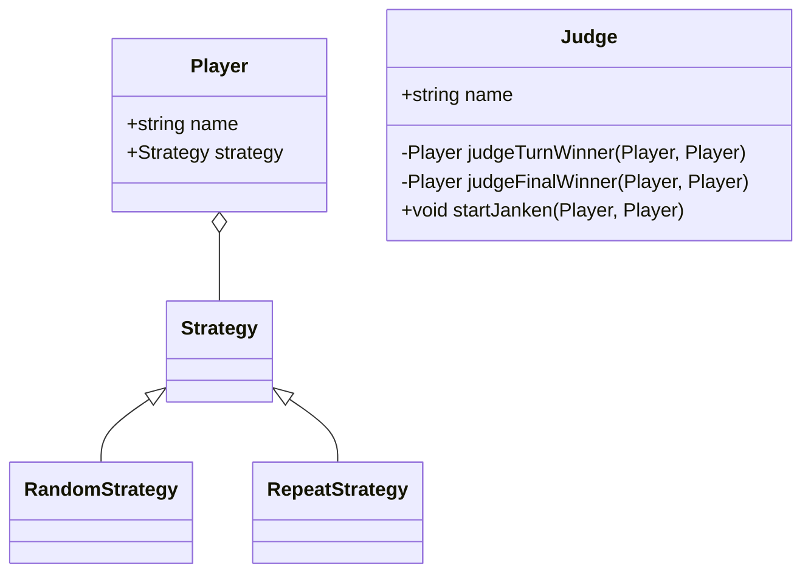

# じゃんけん

```mermaid
classDiagram
    Player o-- Strategy
    Strategy <|-- RandomStrategy
    Strategy <|-- RepeatStrategy

    class Player {
        +string name        
        +Strategy strategy
    }

    class Judge {
        +string name        
        -Player judgeTurnWinner(Player, Player)
        -Player judgeFinalWinner(Player, Player)
        +void startJanken(Player, Player)
    }

```