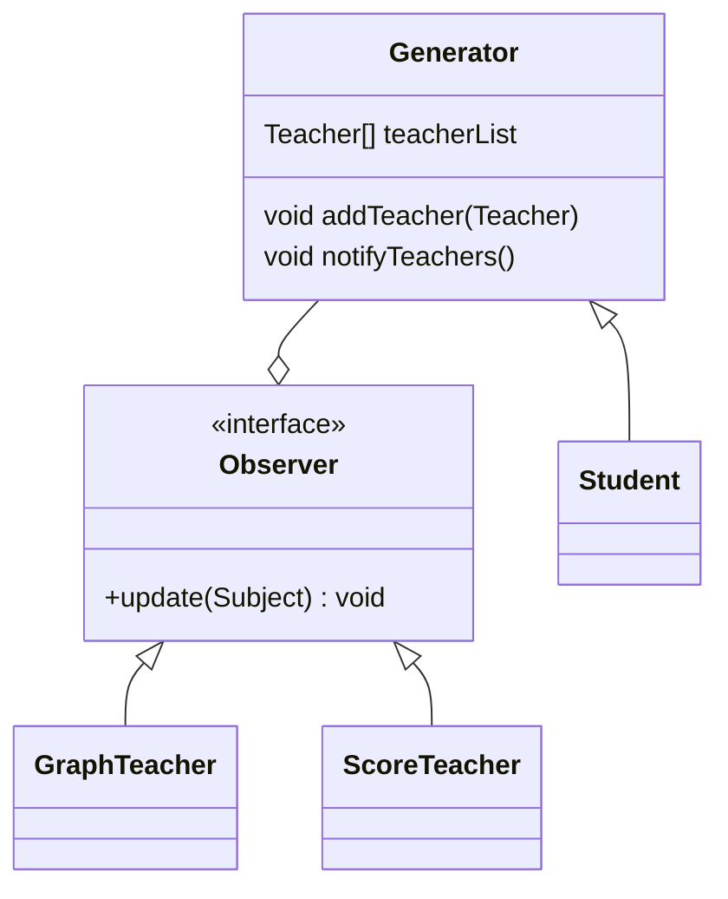

# テストの点数を異なる形式で発表する

- 生徒は3人.全員数学,英語,物理の3科目を受講している
- 各生徒は3科目のテストを実施し,教師に報告する.
- 教師1は生徒から点数の報告を受けたらA~E判定で評価する
- 教師2は生徒から点数の報告を受けたら`*`の数で表現する

```mermaid
classDiagram

class Observer {
  <<interface>>
  +update(Subject) void
}

     class Generator {
        Teacher[] teacherList
        void addTeacher(Teacher)
        void notifyTeachers()
    }

    class Student
    class GraphTeacher
    class ScoreTeacher

    Generator <|-- Student
    Observer <|-- GraphTeacher
    Observer <|-- ScoreTeacher

    Generator --o Observer

```
